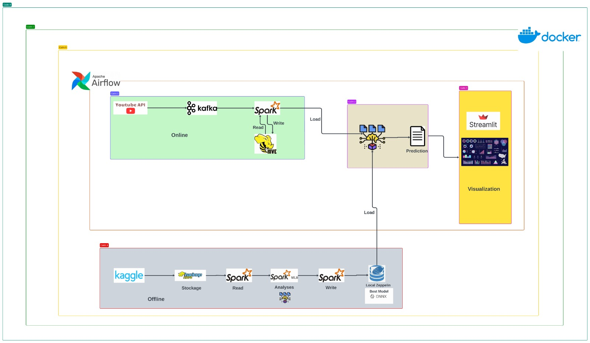

# Product Reputation Tracking and Monitoring Dashboard

## Overview

This repository contains the necessary components to set up a dashboard for tracking and monitoring the reputation of a product. The system is designed to collect data from various sources, process it, and visualize it through a dashboard for insightful analysis.

## Workflow




### Execution of Docker Compose

To deploy the necessary services, use the provided `docker-compose.yml` file. Follow the steps below:

#### Step 1: Initialize Airflow

```bash
docker-compose up airflow-init
```
#### This command initializes the Airflow environment.

#### Step 2: Run Docker Compose

```bash
docker-compose up
```
#### Step 3: Run DAG in Airflow

#### Airflow uses Directed Acyclic Graphs (DAGs) to define and execute workflows. To run the DAG for product reputation tracking, follow these steps:
  1. Access the Airflow web interface at http://localhost:8080 (default credentials: username - airflow, password - airflow).
  2. Navigate to the "DAGs" section in the Airflow UI.
  3. Find the DAG related to product reputation tracking.
  4. Trigger the DAG to start the workflow.


